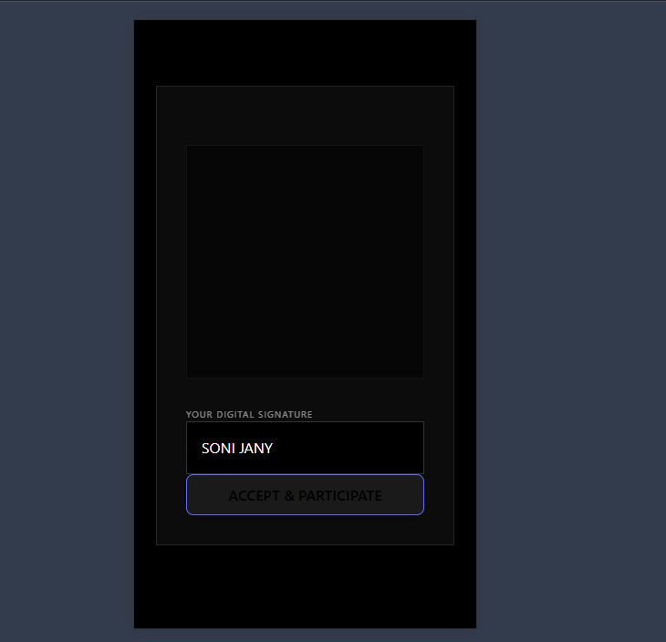
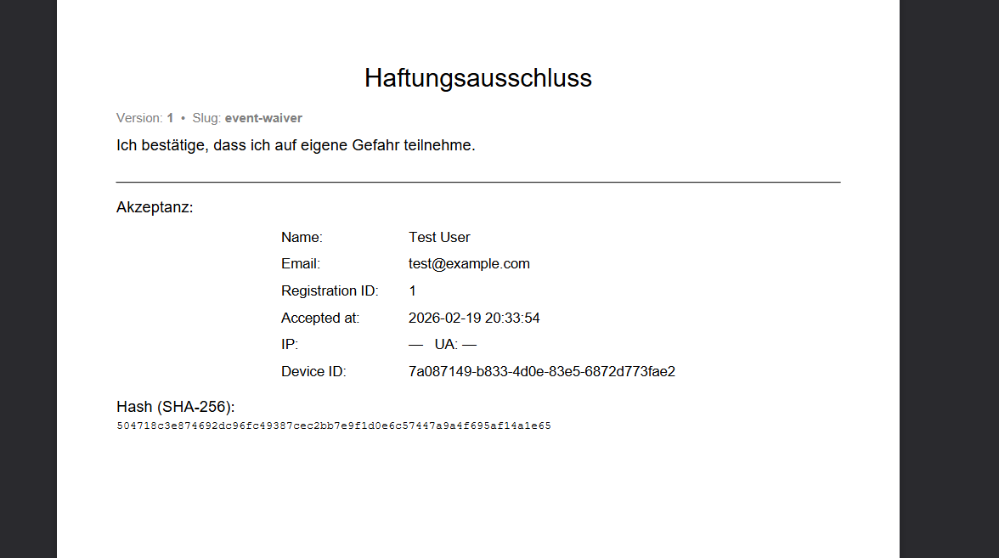

Haselrodeo – Rider - und Event Management System

#Impressionen

| Login | Waiver-Gate | Dashboard |
| :---: | :---: | :---: |
|  |  |  |

#Rechtliche Sicherheit (SHA-256)
Jeder Waiver wird mit einem kryptografischen Hash gesichert.

Die Fullstack-Anwendung wurde entwickelt, um die Registrierung von Fahrern, das Management von Events und den digitalen Haftungsverzicht (Waiver) zu automatisieren.

#Features

•	Rider Access & Security: Ein geschützter Bereich für angemeldete Fahrer mit Login-Funktion.
•	Digital Waiver Workflow: Automatischer Check beim Login, ob ein unterschriebener Haftungsverzicht vorliegt.
•	Dynamic Dashboard: Nach erfolgreicher Prüfung erhält der User Zugriff auf sein Dashboard mit allen Event-Infos und Locations.
•	Waiver Banner & PDF: Direktes Feedback auf der Startseite mit Link zum generierten PDF-Dokument.
•	Event & Quarry Management: Strukturierte Verwaltung von Steinbrüchen und Renndaten im Backend.
________________________________________
# Technologie-Stack

Frontend

•	Framework: React (Vite) mit TypeScript.
•	Styling: Tailwind CSS für ein modernes, responsives Mobile-First Design.
•	Routing: React Router für die Trennung von Login, Waiver und App-Inhalten.

Backend

•	Framework: Django (Python) mit modularer App-Struktur.
•	Apps:
o	registrations: Verwaltung der Fahrer und Haftungsverzichte.
o	events: Zeitplanung und Event-Details.
o	quarries: Location-Management.
•	API: RESTful API-Endpunkte für nahtlose Frontend-Kommunikation.
________________________________________
Showcase

1.	Login & Authentifizierung

Der Einstiegspunkt für den Rider. Hier wird geprüft, ob die E-Mail im System hinterlegt ist.
2. Der Waiver-Check

Ein zentrales Sicherheitsfeature: Die App erkennt im Hintergrund, ob die Registrierung bereits eine gültige Unterschrift hat. Falls nicht, wird der Zugriff blockiert, bis der Waiver unterschrieben wurde.
3. Rider Dashboard

Das Herzstück der App: Ein intuitives Interface, das alle wichtigen Informationen (Events, Bilder, Orga-Chat) auf einen Blick liefert.
________________________________________
#Installation & Setup

Backend

1.	Virtuelle Umgebung erstellen und aktivieren.
2.	Anforderungen installieren: pip install -r requirements.txt.
3.	Datenbank-Migrationen durchführen: python manage.py migrate.
4.	Server starten: python manage.py runserver.
   
Frontend

1.	In den frontend-Ordner navigieren.
2.	Abhängigkeiten installieren: npm install.
3.	Entwicklungs-Server starten: npm run dev.
________________________________________
#Roadmap

•	[x] Grundlegende Django/React Architektur
•	[x] Waiver-Check Logik und PDF-Anbindung
•	[ ] Vollständiges Passwort-Hashing & JWT Auth
•	[ ] Echtzeit-Chat für Rider-Orga
•	[ ] Bilder-Galerie für vergangene Events

_______________________________________
#Hinweis zum Showcase

Dieses Repository dient als Code-Arbeitsprobe. 
Sensible Daten wie Umgebungsvariablen (`.env`) und die Datenbank selbst (`db.sqlite3`) sind aus Sicherheitsgründen nicht enthalten. 
Der Fokus liegt auf der Demonstration von Clean Code, Typisierung und Datenbank-Design.
