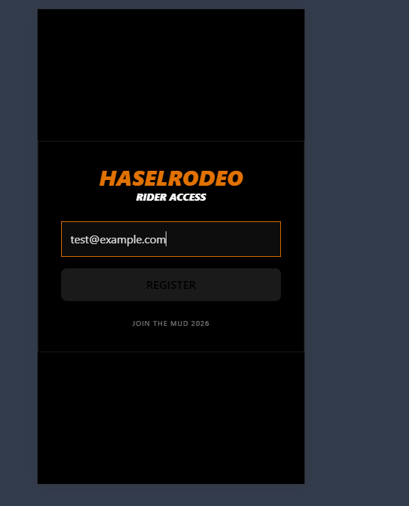
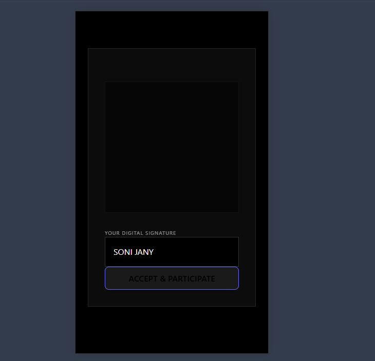
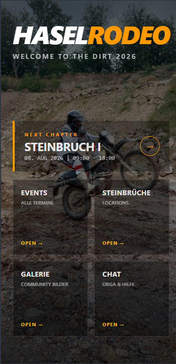
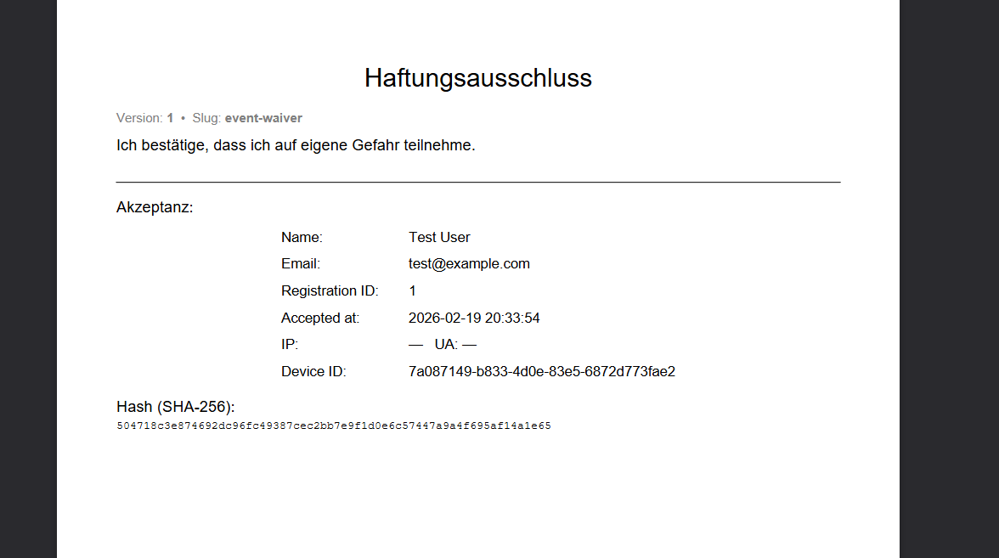

Haselrodeo – Rider & Event-Management-System


# Impressionen

| Login | Waiver-Gate | Dashboard |
| :---: | :---: | :---: |
|  |  |  |

#Rechtliche Sicherheit (SHA-256)
Jeder Waiver wird mit einem kryptografischen Hash gesichert.




Die Haselrodeo App ist eine Full-Stack-Webanwendung zur Organisation von Fahrerregistrierungen, Events und Steinbruch-Informationen für ein privates Enduro-/Offroad-Event.
Dieses Repository ist eine reduzierte Showcase-Version des Haselrodeo-Projekts. Es zeigt den technischen Aufbau und zentrale Funktionen, ohne private Inhalte oder interne Projektdetails öffentlich zu machen.

# Features

- **Rider Access Demo:** Einstieg über eine Login-/Register-Seite als Showcase-Flow.
- **Digital Waiver Workflow:** Beispielhafter Ablauf zur Bestätigung eines Haftungsausschlusses vor dem Zugriff auf die App-Inhalte.
- **Rider Dashboard:** Startseite mit zentralem Einstieg zu Events, Steinbrüchen und weiteren Bereichen.
- **Event & Quarry Management:** Strukturierte Verwaltung von Events und Steinbruch-Informationen im Django-Backend.
- **REST API:** Bereitstellung der Daten über API-Endpunkte für die Kommunikation mit dem React-Frontend.
________________________________________
# Technologie-Stack

## Frontend

- React mit Vite und TypeScript
- Tailwind CSS für ein responsives UI
- React Router zur Trennung von Login, Waiver und App-Inhalten
- API-Anbindung über HTTP-Requests

## Backend

- Django mit modularer App-Struktur
- Django REST Framework für API-Endpunkte
- SQLite für die lokale Entwicklung
- Apps:
  - `registrations`: Registrierung und Waiver-Struktur
  - `events`: Eventdaten und Zeitplanung
  - `quarries`: Steinbruch- und Location-Daten
________________________________________
# Showcase

## 1. Login-/Register-Einstieg
Der Einstiegspunkt der Anwendung ist ein einfacher Login-/Register-Flow. In der Showcase-Version dient dieser Bereich vor allem dazu, den späteren Nutzerfluss abzubilden.

## 2. Waiver-Flow
Vor dem Zugriff auf die eigentlichen App-Inhalte wird ein beispielhafter Haftungsausschluss angezeigt. Die Nutzerin oder der Nutzer bestätigt diesen digital und gelangt anschließend zur Startseite.

## 3. Rider Dashboard
Die Startseite bietet einen Überblick und dient als zentraler Einstieg zu Events, Steinbrüchen und weiteren geplanten Funktionen.
________________________________________
# Installation & Setup

```bash
## Backend

cd backend
python -m venv .venv
.venv\Scripts\activate
pip install -r requirements.txt
python manage.py migrate
python manage.py runserver
   
## Frontend

cd frontend
npm install
npm run dev
```
________________________________________

# Roadmap

- [x] Grundlegende Django/React-Architektur
- [x] Event- und Steinbruch-Struktur
- [x] API-Anbindung zwischen Backend und Frontend
- [x] Showcase-Flow für Login, Waiver und Dashboard
- [ ] Produktive Authentifizierung
- [ ] Serverseitige Speicherung und Prüfung von Waiver-Akzeptanzen
- [ ] PDF-Erzeugung für bestätigte Waiver
- [ ] Echtzeit-Chat für Rider-Orga
- [ ] Bildergalerie für vergangene Events

_______________________________________
# Hinweis zum Showcase

Dieses Repository dient als Code-Arbeitsprobe. 
Sensible Daten wie Umgebungsvariablen (`.env`) und die Datenbank selbst (`db.sqlite3`) sind aus Sicherheitsgründen nicht enthalten. 
Der Fokus liegt auf der Demonstration von Clean Code, Typisierung und Datenbank-Design.
